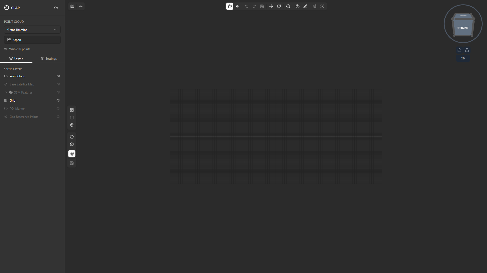
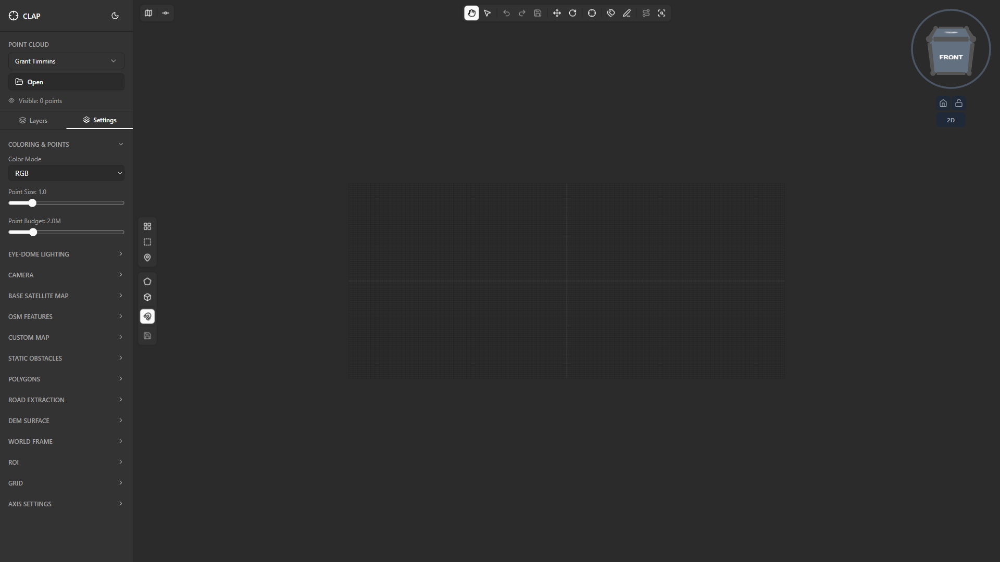
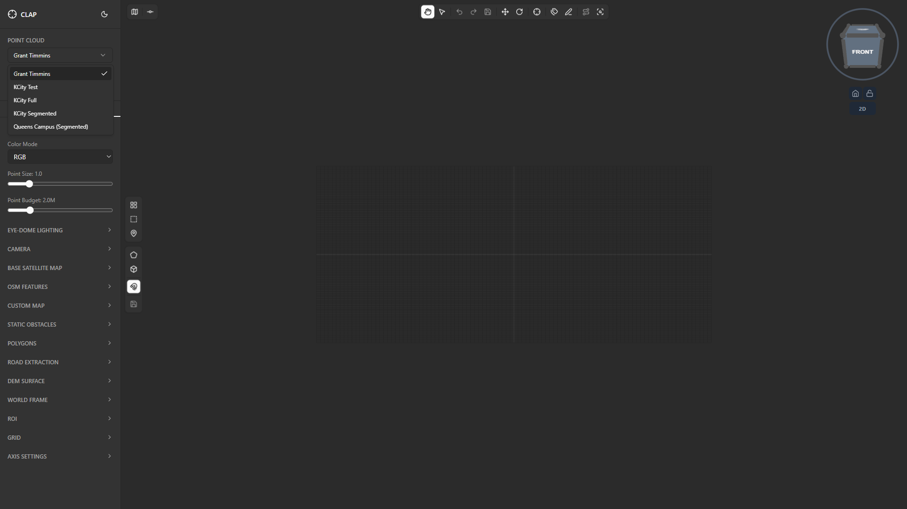
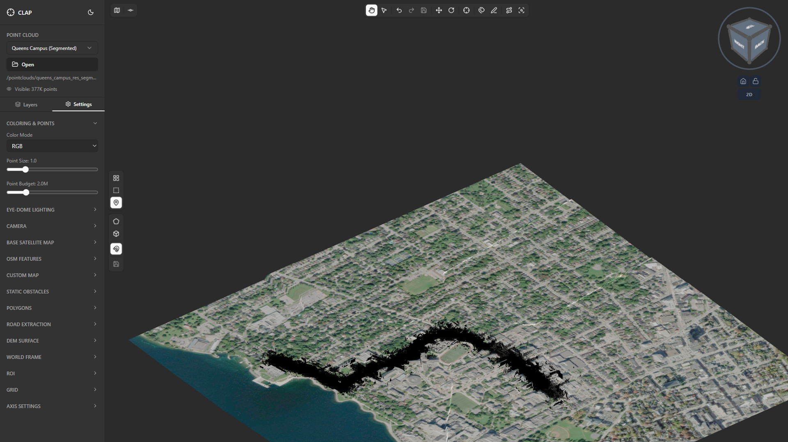

# Section 01: Loading a Point Cloud

This guide walks you through launching CLAP and loading your first point cloud into the 3D viewer. By the end of this section the Queens Campus (Segmented) point cloud will be visible in the viewport and ready to annotate.

---

## Step 1: Launch the Application

**What you see:**
The CLAP window opens to an empty 3D viewport. The toolbar is visible across the top center of the window. The left sidebar may be collapsed or expanded depending on your previous session. The viewport background is dark and contains no point cloud data yet.

**What to do:**
- **Desktop (Electron):** Double-click the CLAP shortcut or run `npm run electron` from the project root. The application opens as a native desktop window.
- **Browser:** Open `http://localhost:5173` in a Chromium-based browser after starting the dev server with `npm run dev`.

**Tips:**
- The first launch may take a few seconds while the renderer initialises.
- If the window appears blank for more than 10 seconds, refresh the page (browser) or restart the application (desktop).
- The title bar shows **CLAP** — Cloud LiDAR Annotation Platform.

---

## Step 2: Identify the Empty Viewer State

**What you see:**
The viewport is empty. The toolbar across the top shows mode buttons from left to right: Grab/Navigate (hand icon), Select Points, Undo, Redo, Save, Translate, Rotate, Set Target POI, Annotate, Reclassify Points, Scan Filter, and Point Info. The status bar at the bottom may show **0 points** or no count at all.

**What to do:**
No action required at this step. Take a moment to orient yourself to the layout:
- **Top center** — Toolbar with mode buttons
- **Left edge** — Collapsible sidebar panel
- **Top right** — Viewport control buttons (Virtual Tiles, ROI, World Frame)
- **Bottom right** — View Cube orientation widget
- **Bottom edge** — Status bar

**Tips:**
- The Grab/Navigate button (leftmost in the toolbar) should be active (highlighted) by default. If it is not, click it now to enter navigation mode before loading a point cloud.

---

## Step 3: Open the Sidebar

**What you see:**
If the sidebar is collapsed, a small arrow or chevron icon is visible on the left edge of the viewport. If the sidebar is already expanded, you will see the Layers and Settings tabs at the top of the panel.

**What to do:**
Click the **arrow / chevron icon** on the left edge to expand the sidebar. The panel slides open to reveal two tabs at the top: **Layers** and **Settings**.

**Tips:**
- The sidebar is approximately 240 px wide when expanded.
- You can collapse it again at any time by clicking the same arrow to recover viewport space.

---

## Step 4: Navigate to the Settings Tab

**What you see:**
The sidebar is open. Two tabs are visible at the top: **Layers** and **Settings**. The Layers tab may be active by default.

**What to do:**
Click the **Settings** tab. The panel contents change to show the following sections stacked vertically:
- Point Cloud
- Color Mode
- Point Size
- Point Budget
- Camera Projection
- EDL (Eye-Dome Lighting)
- Theme

**Tips:**
- If you do not see all sections, scroll down inside the sidebar — sections below the fold are accessible by scrolling the sidebar content.

---

## Step 5: Locate the Point Cloud Section

**What you see:**
At the top of the Settings panel is the **Point Cloud** section. Its appearance differs between desktop and browser:

- **Desktop (Electron):** An **Open Folder** button is shown. Clicking it opens a native OS folder picker dialog.
- **Browser:** A **dropdown selector** is shown listing all point clouds available in the `public/pointclouds/` directory.

**What to do:**
Identify which mode you are running in and proceed to the appropriate step below.

**Tips:**
- In browser mode the list is populated automatically from the server — no folder browsing is required.
- In desktop mode you will need to navigate to the folder that contains the converted point cloud data (a `metadata.json` file must be present at the root of that folder).

---

## Step 6: Select the Queens Campus (Segmented) Point Cloud

**What you see:**

- **Desktop:** The OS folder picker dialog is open. Navigate to your `public/pointclouds/` directory (or wherever your converted data lives).
- **Browser:** The dropdown selector is open and lists available point clouds.

**What to do:**

- **Desktop:** Navigate to the `queens-campus-segmented` folder (or the folder containing the `metadata.json` for that scan) and click **Select Folder** / **Open**.
- **Browser:** Click the dropdown and select **Queens Campus (Segmented)** from the list.

**Tips:**
- The folder you select must contain a `metadata.json` file generated by PotreeConverter. Selecting a folder without this file will produce an error.
- The name displayed in the dropdown is derived from the folder name. If you have renamed a folder you may see a different label.

---

## Step 7: Wait for the Loading State

**What you see:**
A loading spinner or progress indicator appears in the viewport or overlaid on the Point Cloud section. The viewport may briefly flash as the renderer initialises the octree and streams the first tiles.

**What to do:**
Wait for loading to complete. No interaction is required during this phase. Typical load time for an initial tile stream is 2–5 seconds on a local machine.

**Tips:**
- CLAP uses progressive streaming — lower-detail tiles appear first, followed by higher-detail tiles as they load.
- If loading stalls for more than 30 seconds, check that the `metadata.json` path is correct and that all octree tile files are present in the same directory.
- Do not click away from the Settings panel during the initial load; doing so is harmless but may cause a brief re-render.

---

## Step 8: Point Cloud Appears in the Viewport

**What you see:**
The Queens Campus (Segmented) point cloud fills the 3D viewport. Points are coloured by their classification category (buildings, ground, vegetation, etc.) using the default colour mode. The camera is positioned to show an overview of the entire scan.

**What to do:**
Confirm that the point cloud is visible and coloured. If you see only a grey or black viewport, try:
1. Scrolling the mouse wheel toward the viewport to zoom in — the camera may be positioned far from the data.
2. Double-clicking on an area where points should exist to snap the camera pivot to that location.

**Tips:**
- The initial camera view frames the bounding box of the entire point cloud.
- Classification colours follow standard LiDAR conventions: brown/tan = ground, green = vegetation, grey = buildings, white = unclassified.
- You can change the colour scheme at any time using the **Color Mode** selector in the Settings panel.

---

## Step 9: Verify the Point Count in the Status Bar

**What you see:**
The status bar along the bottom of the viewport now displays a point count such as **1,240,000 points visible** (the exact number depends on the current zoom level, Point Budget setting, and which tiles are streamed).

**What to do:**
Check that the point count is a non-zero value. A zero count when the viewport appears populated indicates a display glitch — switching the Color Mode and switching back will force a refresh.

**Tips:**
- The visible point count updates dynamically as you zoom, pan, and orbit. Zooming in increases the detail level and may increase the count; zooming out may reduce it as distant tiles are culled.
- The **Point Budget** setting in the Settings panel (range: 100 k – 10 M) caps the maximum number of points rendered at any one time. Increase it on powerful hardware for higher visual fidelity.
- The count shown is the number of points currently streamed to the GPU, not the total count in the full dataset.

---

## Summary

You have successfully loaded the Queens Campus (Segmented) point cloud into the CLAP 3D viewer. The workflow is the same for any other point cloud:

1. Open the sidebar and go to the **Settings** tab.
2. Use **Open Folder** (desktop) or the **dropdown** (browser) in the **Point Cloud** section.
3. Select the folder or dataset.
4. Wait for the progressive stream to complete.

Continue to [Section 02: Viewer Controls](../02-viewer-controls/guide.md) to learn how to navigate the 3D viewport.
