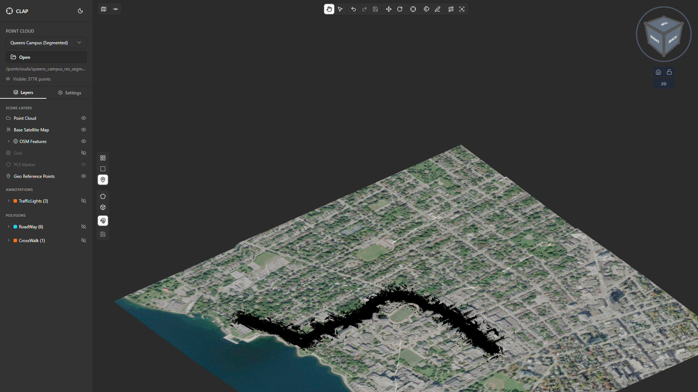
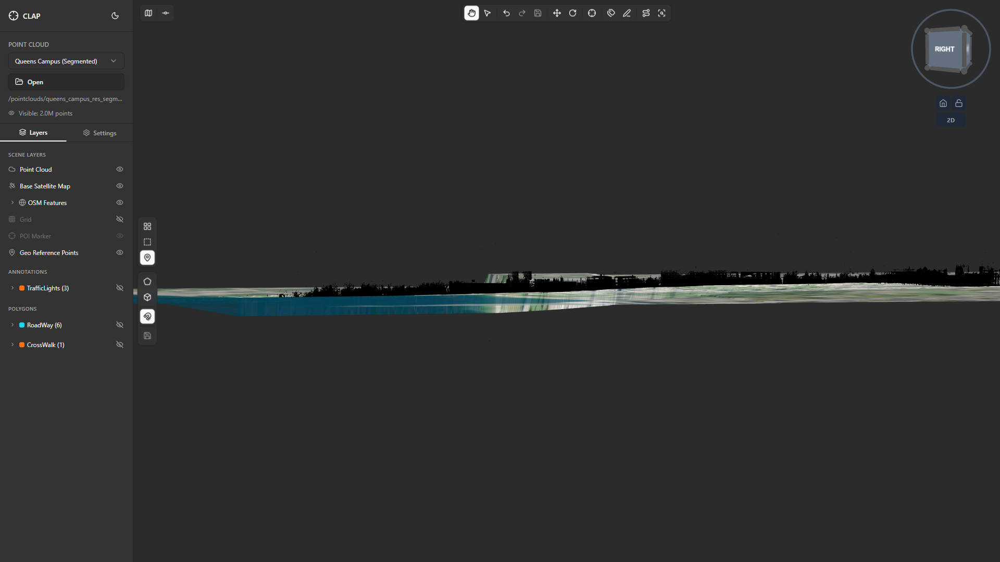
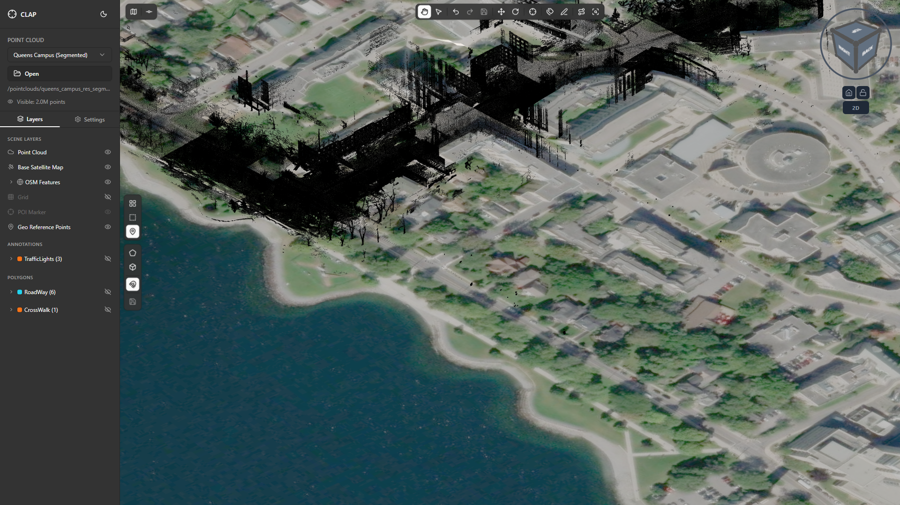
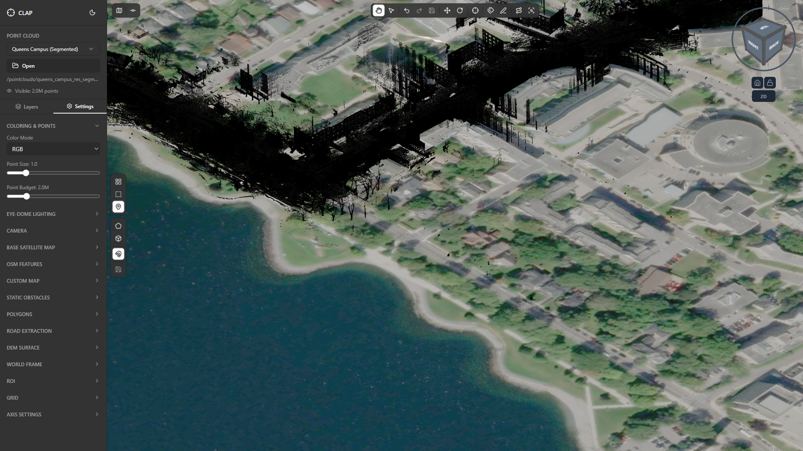
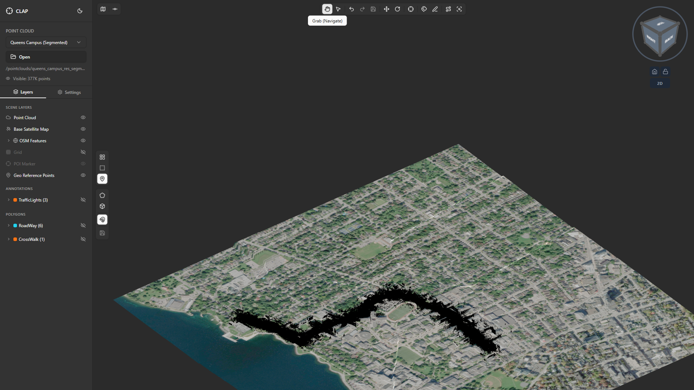

# Section 02: Viewer Controls

This guide covers every way to navigate the CLAP 3D viewport — orbiting, panning, zooming, resetting the view, using the View Cube, and switching camera projections. All examples use the Queens Campus (Segmented) point cloud loaded in [Section 01](../01-loading-a-project/guide.md).

---

## Step 1: Overview of the Camera Control System

**What you see:**
The Queens Campus point cloud is displayed in the 3D viewport. The View Cube is visible in the bottom-right corner. The toolbar at the top shows the Grab/Navigate button as the active (highlighted) mode.

**What to do:**
Before navigating, confirm that **Grab/Navigate** mode is active — it is the leftmost button in the toolbar (hand icon). If another tool is selected, click the Grab/Navigate button to return to navigation mode. Navigation controls only operate correctly in this mode.

**Camera system overview:**

| Action | Input |
|---|---|
| Orbit / rotate | Middle mouse button (scroll wheel click) + drag |
| Zoom | Scroll wheel |
| Pan | Right mouse button + drag |
| Focus on point | Double-click a point |
| Laptop orbit | Ctrl + Shift + Left mouse button + drag |
| Laptop zoom | Two-finger scroll on trackpad |

**Tips:**
- The camera orbits around a **pivot point** — the point in the scene the camera rotates around. Double-clicking on a point sets a new pivot at that location.
- The default projection on launch is **Orthographic**. You can switch to Perspective in the Settings panel (covered in Step 8).

---

## Step 2: Orbiting the Camera

**What you see:**
The Queens Campus point cloud is visible. As you orbit, the viewing angle changes — buildings tilt, the ground plane rotates, and the View Cube in the bottom-right rotates to reflect the new orientation.

**What to do:**
1. Position your cursor over the point cloud in the viewport.
2. Press and hold the **middle mouse button** (scroll wheel click).
3. While holding, **drag** in any direction:
   - Drag left/right to rotate the camera horizontally (yaw).
   - Drag up/down to rotate the camera vertically (pitch).
4. Release the middle mouse button to stop orbiting.

**Tips:**
- Orbit speed is proportional to how fast you drag.
- The camera always orbits around the current pivot point. If the pivot is far from the point cloud, the rotation may appear to swing wildly. Double-click on a point first to reset the pivot (see Step 6).
- You cannot pitch the camera fully upside-down — the orbit clamps near the vertical poles to prevent disorienting views.

---

## Step 3: Panning the Camera

**What you see:**
The point cloud slides across the viewport as you pan. The View Cube orientation does not change during a pure pan — only the camera position shifts.

**What to do:**
1. Position your cursor over the viewport.
2. Press and hold the **right mouse button**.
3. While holding, **drag** in any direction:
   - Drag left/right to pan the camera horizontally.
   - Drag up/down to pan the camera vertically.
4. Release the right mouse button to stop panning.

**Tips:**
- Pan moves the camera parallel to the current view plane. It does not change the zoom level or orbit angle.
- Panning is useful for exploring large point clouds after you have zoomed into a region of interest.
- If you pan too far and lose the point cloud, use **double-click** on any visible point (Step 6) or reset the view via the View Cube (Step 7) to re-centre.

---

## Step 4: Zooming with the Scroll Wheel

**What you see:**
Scrolling the mouse wheel moves the camera toward or away from the current pivot point. Points grow larger as you zoom in and smaller as you zoom out. The point density increases as higher-detail tiles are streamed in when you zoom into a specific area.

**What to do:**
1. Position your cursor over the area you want to zoom into.
2. **Scroll up** (away from you) to zoom in — the camera moves closer to the scene.
3. **Scroll down** (toward you) to zoom out — the camera pulls back.

**Tips:**
- Zoom is directed toward the cursor position, not the screen centre. Placing the cursor over a specific building before scrolling will zoom into that building.
- If you scroll all the way in and the point cloud disappears, you may have passed through the data. Scroll back out slowly.
- For fine-grained control in a small area, use small scroll increments and combine with double-clicking on a point to re-anchor the pivot before zooming.

---

## Step 5: Laptop and Trackpad Controls

**What you see:**
The same 3D viewport. On a laptop without a dedicated scroll wheel click, the orbit and zoom controls are mapped to alternative inputs.

**What to do:**

**Orbit (no middle mouse button):**
1. Hold **Ctrl + Shift** on the keyboard.
2. Press and hold the **left mouse button**.
3. Drag to orbit — the behaviour is identical to middle mouse button drag.

**Zoom (trackpad):**
- Use a **two-finger scroll** gesture on the trackpad surface (same direction convention: two fingers up = zoom in, two fingers down = zoom out).

**Pan (trackpad):**
- Right-click drag still works if your trackpad supports two-finger tap as right-click, or use a physical right mouse button.

**Tips:**
- The Ctrl+Shift+LMB shortcut is designed for laptop users but works on any device — you can use it as a preference even when a middle mouse button is available.
- Some laptops remap scroll gestures — if two-finger scroll does not work, check your trackpad driver settings.

**Keyboard shortcuts summary:**

| Action | Shortcut |
|---|---|
| Orbit (laptop) | Ctrl + Shift + LMB drag |
| Zoom (trackpad) | Two-finger scroll |

---

## Step 6: Resetting the Camera View — Double-Click Focus

**What you see:**
After double-clicking on a point, the camera smoothly animates to re-centre the view on that point. The pivot is moved to the clicked location. This is the fastest way to navigate to a specific area of the point cloud.

**What to do:**
1. Ensure **Grab/Navigate** mode is active (leftmost toolbar button).
2. Identify a point or area in the viewport you want to navigate to.
3. **Double-click** on that point with the left mouse button.
4. The camera pivots and centres on that point. Subsequent orbits will rotate around this new pivot.

**Tips:**
- Double-click focus is the most efficient navigation technique for exploring a large point cloud like the Queens Campus scan. Click on a building rooftop, then orbit around it, then double-click on a road feature, then orbit again.
- If you double-click on an empty area (no points), the command may not register. Aim for a visible cluster of points.
- You can also refocus by clicking a face of the View Cube (Step 7) which resets to a standard axis-aligned view.

---

## Step 7: The View Cube

**What you see:**
The View Cube is an interactive 3D cube widget in the bottom-right corner of the viewport. It displays the current camera orientation in real time — as you orbit, the cube rotates to match. The cube faces are labelled with directions (Top, Front, Right, etc.).

**What to do:**
Click different parts of the View Cube to snap the camera to standard axis-aligned views:

| Click target | Result |
|---|---|
| **Top face** | Top-down plan view (looking straight down, Z-axis) |
| **Front face** | Front elevation view |
| **Right face** | Right side elevation view |
| **Left face** | Left side elevation view |
| **Back face** | Rear elevation view |
| **Bottom face** | View from below |
| **Edge** (between two faces) | 45° view along that edge axis |
| **Corner** (where three faces meet) | Isometric-style corner view |

The camera animates smoothly to the target orientation.

**Tips:**
- The **Top face** (plan view) is particularly useful for LiDAR annotation — it gives a bird's eye view that makes it easy to draw polygon annotations over roads and buildings.
- After clicking a View Cube face, you can still orbit freely from the new angle using middle mouse button drag.
- The View Cube does not change the zoom level — only the camera angle is affected. You may need to zoom after snapping to a new view.

---

## Step 8: Switching Camera Projection (Perspective / Orthographic)

**What you see:**
In the Settings panel (left sidebar, Settings tab), the **Camera Projection** section contains a toggle or selector to switch between **Orthographic** and **Perspective** projection.

- **Orthographic:** Parallel projection — objects do not appear smaller with distance. Useful for accurate spatial measurements and annotation.
- **Perspective:** Simulates a real camera — objects appear smaller as they get further away. More natural and immersive for exploring.

**What to do:**
1. Open the left sidebar and click the **Settings** tab if not already active.
2. Scroll down to the **Camera Projection** section.
3. Click the toggle or selector to switch between **Orthographic** and **Perspective**.
4. The viewport updates immediately.

**Tips:**
- CLAP defaults to **Orthographic** projection, which is recommended for annotation work because it provides a distortion-free view and accurate relative sizing.
- Switch to **Perspective** when you want to explore the scene for a more intuitive 3D sense of depth — for example when reviewing the overall structure of the Queens Campus before beginning annotation.
- Switching projection resets the camera view slightly. If you switch modes, you may need to re-zoom to your area of interest.

---

## Step 9: The Grab/Navigate Toolbar Button

**What you see:**
The toolbar across the top of the window shows all mode buttons. The **Grab/Navigate** button (hand icon, leftmost position) is highlighted/active, indicating the viewport is in navigation mode.

**What to do:**
If any other tool is active (e.g., Select Points, Annotate, Reclassify), clicking in the viewport will perform that tool's action rather than navigating. To return to free navigation:

1. Click the **Grab/Navigate** button in the toolbar (leftmost button, hand icon).
2. The button becomes highlighted to confirm navigation mode is active.
3. All mouse inputs (middle drag, right drag, scroll) now control the camera.

**Tips:**
- You can always tell which tool is active by looking at the highlighted button in the toolbar.
- Orbit, pan, and zoom with the middle mouse button, right mouse button, and scroll wheel work in **all** modes — you do not need to switch to Grab/Navigate just to orbit. However, left-click actions vary by mode, and returning to Grab/Navigate prevents accidental edits.
- A quick workflow: annotate in Annotate mode → middle-mouse orbit to check your work → left-click in Annotate mode to continue. You rarely need to switch back to Grab/Navigate unless you want left-click to be harmless.

---

## Step 10: Practical Navigation — Exploring the Queens Campus

**What you see:**
The Queens Campus (Segmented) point cloud from an isometric overview angle. Buildings, roads, vegetation, and ground points are visible with classification colouring.

**Recommended navigation workflow for a new point cloud:**

1. **Start with the top-down view.** Click the **Top face** of the View Cube. This gives you a plan view of the entire campus.

2. **Zoom into an area of interest.** Scroll the mouse wheel toward an area — a building cluster, a road intersection, or a parking area.

3. **Double-click to anchor the pivot.** Double-click on a specific point to set the orbit pivot at that location.

4. **Orbit to inspect in 3D.** Hold the middle mouse button and drag to rotate around the anchor point. Inspect the geometry from multiple angles.

5. **Pan to a neighbouring area.** Right-click drag to shift sideways to an adjacent region without losing your zoom level.

6. **Reset to overview.** Click the **Top face** on the View Cube to return to the plan view, then scroll out to see the full campus again.

**Tips for the Queens Campus scan specifically:**
- The campus is a large dataset. Start at a low zoom level and zoom in progressively — this allows tiles to stream at the right resolution.
- Ground-level detail (kerbs, road markings, low vegetation) is only visible when zoomed to within 20–50 m of the data. At overview zoom levels these features are too small to see.
- Switch to **Perspective** projection (Step 8) for a more intuitive feel when doing a first-pass exploration, then switch back to **Orthographic** when you are ready to annotate.
- If the frame rate drops when you zoom into a dense area, reduce the **Point Budget** in the Settings panel (e.g., from 5 M to 2 M) to keep navigation responsive.

---

## Summary — Controls Quick Reference

| Action | Mouse / Keyboard |
|---|---|
| Orbit | Middle mouse button drag |
| Orbit (laptop) | Ctrl + Shift + LMB drag |
| Pan | Right mouse button drag |
| Zoom | Scroll wheel |
| Zoom (trackpad) | Two-finger scroll |
| Focus on point | Double-click (LMB) |
| Snap to standard view | Click View Cube face / edge / corner |
| Return to navigation mode | Click Grab/Navigate button (toolbar) |
| Switch projection | Settings → Camera Projection |

Continue to [Section 03: Color Modes](../03-color-modes/guide.md) to learn how to change the point cloud colour scheme for different annotation tasks.
