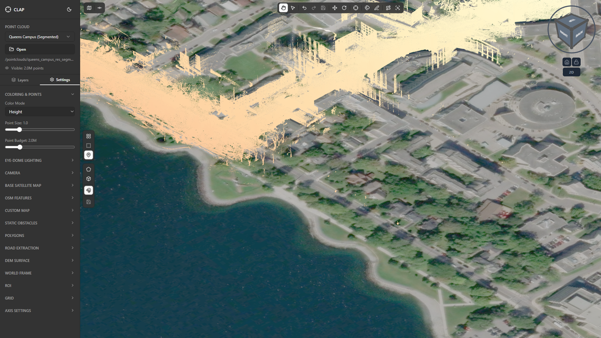
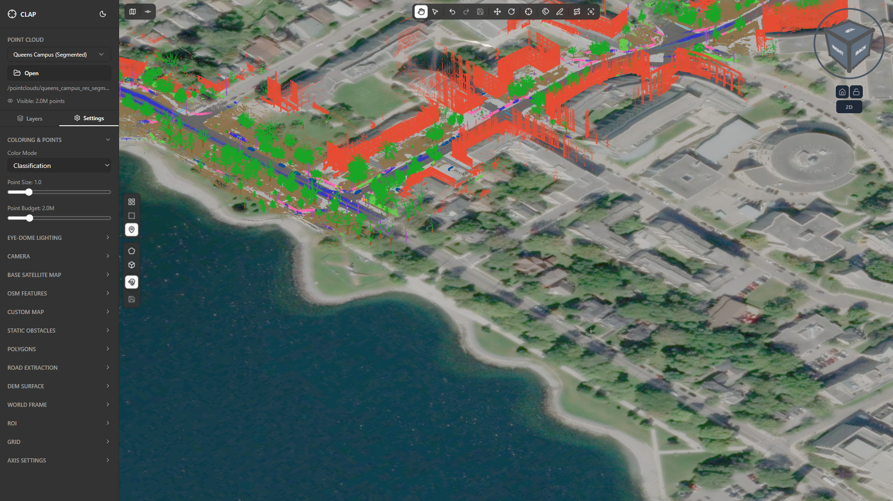
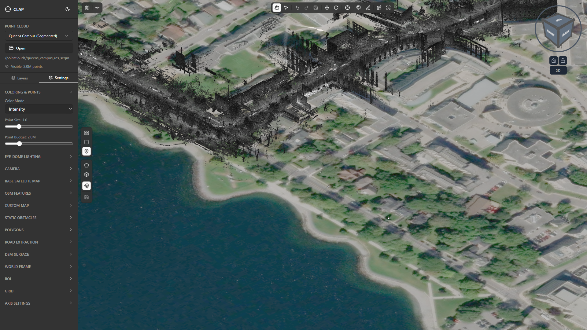

# 03 — Color Modes

Color modes control how the raw point cloud data is translated into visible colors in the viewport. Choosing the right mode is one of the most important decisions when working with a LiDAR scene — each mode surfaces a completely different layer of information that is invisible in the others. This guide covers all four color modes available in CLAP, using the **Queens Campus (Segmented)** point cloud as the reference scene throughout.

---

## What color modes are and why they matter

A LiDAR scan records far more than geometry. Each point carries several data channels simultaneously: the RGB color captured by a co-mounted camera, the elevation (Z coordinate), a classification code assigned by preprocessing software, and a return-intensity value produced by the laser itself. A color mode selects one of those channels and maps it to visible pixel color.

This distinction matters for annotation work because:

- **Visual inspection** of the built environment benefits from RGB — the scene looks photorealistic and features are immediately recognizable.
- **Terrain analysis** benefits from Height mode — elevation differences invisible in RGB become a striking gradient.
- **Reviewing automated classification** benefits from Classification mode — every class label is shown as a unique color, making misclassified regions immediately obvious.
- **Surface-type identification** benefits from Intensity mode — road markings, retroreflective signs, and water bodies produce characteristic intensity signatures that color cameras cannot distinguish.

Switching modes is non-destructive and instantaneous — the underlying point data is never altered.

---

## Accessing color mode settings

Color mode is controlled from the **Settings** tab in the left sidebar.

1. Open the sidebar if it is collapsed by clicking the panel icon at the top-left of the toolbar.
2. Click the **Settings** tab (the sliders icon).
3. Scroll down to the **Color Mode** section — it appears near the top of the settings list, below the panel header.

The Color Mode section shows four options as a radio group or segmented control: **RGB**, **Height**, **Classification**, and **Intensity**. Clicking any option applies it immediately to the viewport without a page reload.

The sidebar is approximately 240 px wide. If your monitor is running at a lower resolution, the viewport automatically reflows — all controls remain accessible by scrolling within the sidebar.

---

## RGB mode

**RGB** renders each point using the red, green, and blue color values recorded by a camera co-registered with the LiDAR scanner. The result looks similar to a dense photogrammetry model or a colored mesh — buildings appear in their true facade color, roads in their actual asphalt gray, trees in seasonal green or brown.

### When to use RGB

- First look at any new scan — RGB is the fastest way to verify data quality and scan coverage.
- Visual inspection work where a human reviewer needs to identify real-world objects by appearance.
- Generating screenshots or reports for stakeholders who are unfamiliar with LiDAR.
- Cross-referencing with aerial imagery to validate spatial alignment.

### Queens Campus in RGB

In the Queens Campus scene, RGB mode reveals the campus in naturalistic color: red-brick building facades along the north edge, concrete-gray pathways, dark asphalt roads, and deciduous tree canopies in varying greens. The photorealism makes it easy to spot where scan coverage thins out — those areas appear with fewer, more scattered points and the background color of the viewport shows through.

> **Note:** RGB quality depends on how well the camera and scanner were calibrated. In some scans, color saturation may appear washed out or contain minor misalignment halos around sharp edges.

---

## Height mode

**Height** mode assigns color based on each point's Z coordinate (elevation above the local datum). The default gradient runs from cool blue at the lowest elevations through green and yellow to warm red at the highest elevations — the same convention used in topographic maps.

### The elevation gradient

| Relative elevation | Color |
|---|---|
| Lowest points | Deep blue |
| Low-mid range | Cyan / teal |
| Mid range | Green |
| Upper-mid range | Yellow / orange |
| Highest points | Bright red |

The gradient is normalized to the min/max Z range of the currently loaded point cloud, so it adapts automatically to scenes at different absolute elevations.

### When to use Height mode

- Terrain analysis — identifying slopes, raised curbs, steps, ramps, and bridge decks is trivial when every centimeter of elevation is encoded in color.
- Diagnosing scan alignment issues — misaligned passes show as horizontal color banding within surfaces that should be flat.
- Spotting noise points above or below the main scene — stray returns from rain, insects, or scanner artifacts cluster at extreme Z values and appear as isolated red or blue speckles far from the main point cloud body.

### Queens Campus in Height mode

Switching to Height mode on the Queens Campus scan immediately reveals the campus topography. The main roadways sit in a mid-elevation green band. Building rooftops push into yellow and orange. Tree canopies reach the red end of the spectrum. The ground plane around the campus perimeter shows a subtle slope from south (slightly lower, bluer) to north (slightly higher, greener), which is invisible in RGB.

---

## Classification mode

**Classification** mode assigns a unique, fixed color to each numeric classification code stored in the point cloud. This is the primary working mode for reviewing and correcting automated segmentation results.

### How the color-per-class scheme works

Classification codes are integers stored per point in the LAS/LAZ file format. CLAP maps each code to a distinct color drawn from a high-contrast palette designed to remain distinguishable even at small point sizes. The mapping is stable across sessions — class 6 (Buildings) is always the same color regardless of which file is open.

### Queens Campus classification legend

The Queens Campus (Segmented) point cloud uses the following classes:

| Code | Label | Typical color in CLAP |
|---|---|---|
| 2 | Roads | Gray |
| 3 | Sidewalks | Light tan |
| 4 | OtherGround | Brown |
| 5 | TrafficIslands | Orange |
| 6 | Buildings | Red |
| 7 | Trees | Dark green |
| 8 | OtherVegetation | Lime green |
| 9 | TrafficLights | Cyan |
| 10 | TrafficSigns | Magenta |
| 11 | Wires | Yellow |
| 12 | Masts | Purple |
| 13 | Pedestrians | Blue |
| 15 | TwoWheel | Pink |
| 16 | MobFourWheel | Teal |
| 17 | StaFourWheel | Dark orange |
| 18 | Noise | White / bright |
| 40 | TreeTrunks | Dark brown |

> The exact palette hex values are defined in the viewer engine. If you need to match them for report graphics, see `src/features/viewer/services/viewer-engine.ts`.

### Reading the classification display

When Classification mode is active, the point cloud becomes a color-coded map of every label decision made during preprocessing. Reviewing the scene in this mode you are looking for:

- **Unexpected color patches** inside a homogeneous surface — e.g., blue (Pedestrian) points on a rooftop indicate a misclassification.
- **Ragged class boundaries** — the edge between Roads (gray) and Sidewalks (tan) should be clean. A fuzzy, interleaved boundary often means the preprocessing algorithm used too-coarse voxels.
- **Unclassified / wrong-code clusters** — any large region rendered in an unexpected color warrants investigation.

The classification legend is visible in the bottom-right corner of the viewport when Classification mode is active.

### When to use Classification mode

- All reclassification and annotation review workflows — this is your primary working mode when editing class labels.
- Quality-checking output from automated segmentation pipelines.
- Training new annotators — the color coding makes it easy to explain what each region represents.

---

## Intensity mode

**Intensity** mode renders each point as a grayscale value proportional to the laser return intensity recorded by the scanner. High-intensity returns appear bright white; low-intensity returns appear dark gray or black.

### What intensity reveals about surfaces

The intensity value is determined by how much of the emitted laser pulse was reflected back to the scanner. Key factors:

- **Retroreflective materials** (road markings, traffic signs, reflective tape) return very high intensity — they appear as bright white features that stand out sharply against surrounding surfaces.
- **Dark, absorptive surfaces** (wet asphalt, dark roof material, shadow areas) return low intensity — they appear nearly black.
- **Vegetation** typically returns moderate, variable intensity due to the irregular scattering of leaves.
- **Water** often returns near-zero intensity because water absorbs or scatters the laser at near-infrared wavelengths — water bodies frequently appear as gaps or very dark regions.

### When to use Intensity mode

- Locating road markings (lane lines, crosswalks, stop bars) that have near-zero visual contrast in RGB.
- Identifying retroreflective traffic signs before running a sign extraction workflow.
- Diagnosing sensor calibration issues — a correctly calibrated scanner produces consistent intensity across overlapping passes; inconsistencies show as stripe artifacts.
- Supplementing classification review: a patch of points classified as Roads but showing high intensity may actually be a road marking that deserves its own class.

### Queens Campus in Intensity mode

In the Queens Campus scene, Intensity mode makes several features visible that are easy to miss in RGB: the crosswalk striping on the main entrance road appears as bright parallel bars, the retroreflective stop signs stand out as bright hotspots, and the rooftop HVAC equipment produces a characteristic high-intensity cluster distinct from the surrounding roof membrane.

---

## Switching between modes live

Changing color mode is immediate — there is no loading delay or page navigation required.

1. Ensure the **Settings** tab is open in the left sidebar.
2. Find the **Color Mode** section.
3. Click the target mode option: **RGB**, **Height**, **Classification**, or **Intensity**.
4. The viewport updates in real time.

You can switch modes as many times as you like without any effect on the underlying point data. This makes it practical to rapidly alternate between Classification and RGB to cross-reference a suspect region.

> **Keyboard shortcut:** There is no dedicated hotkey for color mode cycling in the current release. Use the sidebar controls.

---

## Practical tips

### For reclassification work

Use **Classification** mode as your default when you are actively editing class labels. The color-coded display makes misclassified regions immediately visible and lets you evaluate the impact of each edit in real time. Switch to **RGB** briefly to confirm whether an ambiguous cluster is, for example, a parked vehicle or a piece of street furniture — then return to Classification mode to apply the correction.

### For visual inspection and reporting

Use **RGB** mode for screenshots destined for reports or stakeholder review. RGB screenshots are immediately interpretable to anyone regardless of their LiDAR experience. Follow up with a **Classification** mode screenshot of the same view to show the annotation state alongside the naturalistic image.

### For terrain and infrastructure geometry review

Use **Height** mode when you are evaluating elevation relationships — curb heights, road camber, building step-backs, or antenna mast heights. The gradient reveals sub-centimeter differences that are invisible in both RGB and Classification.

### For surface reflectivity analysis

Use **Intensity** mode when you are specifically looking for retroreflective features, water surfaces, or scanner calibration artifacts. It is also a useful sanity check before running any automated road marking extraction: if your markings are not bright in Intensity mode, the scanner may not have sufficient return to detect them reliably.

---

*Next section: [04 — Point Display Settings](../04-point-display-settings/guide.md)*
