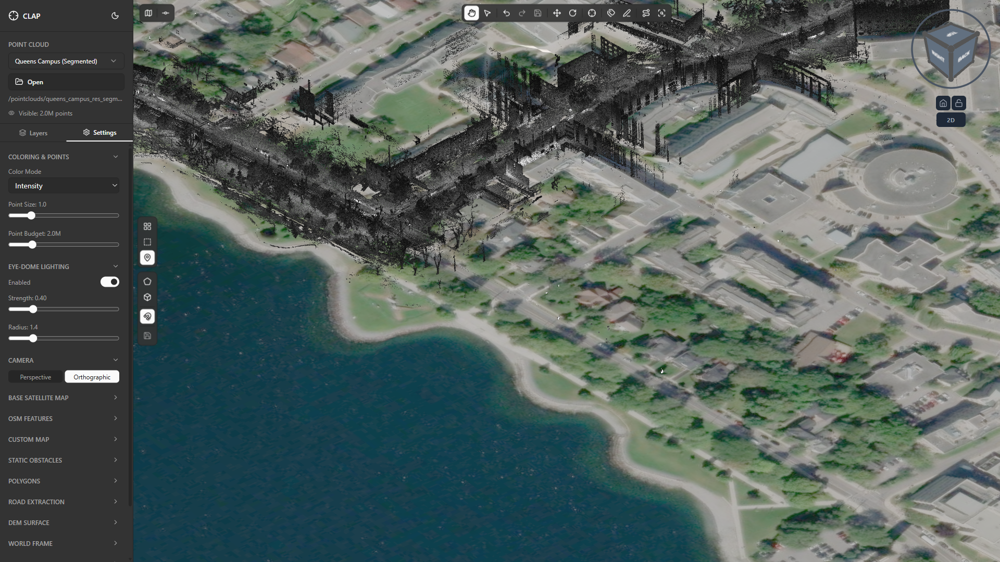

# 04 — Point Display Settings

Point display settings govern the visual quality and rendering performance of the 3D viewport. Unlike color modes, which change the meaning of the colors you see, these settings change how densely and how crisply the point cloud is drawn. Understanding the tradeoffs between point budget, point size, EDL, and camera projection lets you configure CLAP for the exact task at hand — whether that is a quick navigation pass on a low-powered laptop or a full-detail annotation session on a workstation.

All controls described in this section are located in the **Settings** tab in the left sidebar.

---

## Point Budget

### What point budget controls

A LiDAR point cloud at full resolution can contain tens or hundreds of millions of points. Rendering all of them simultaneously at interactive frame rates is not feasible on most hardware. CLAP uses a **point budget** to cap the maximum number of points drawn per frame. The renderer selects the most spatially relevant points up to that cap — typically the highest-octree-level points at the current camera distance — and discards the rest for that frame.

The effect is that regions close to the camera and regions you are looking at directly receive the most detail, while distant or off-axis regions thin out. As the camera moves, the selection updates dynamically.

The point budget slider ranges from **100,000** to **10,000,000 (10 M)**, with a default of **2,000,000**.

### Increasing point budget for higher quality

Raising the budget toward 10 M increases the density of visible points across the entire scene. At high budgets:

- Fine structural details become visible — individual curb faces, thin wire strands, window frame geometry.
- The scene feels "solid" rather than sparse.
- Frame rate will decrease on machines without a dedicated GPU. If the viewport drops below ~15 fps, lower the budget or enable progressive rendering.

**Recommended use:** Set point budget to 5 M–10 M when performing close-up annotation or classification work where point-level precision matters.

### Decreasing point budget for navigation on slower machines

Lowering the budget toward 100 K–500 K makes the scene much sparser but significantly faster to render. At low budgets:

- The scene appears skeletal — only the coarsest octree level is shown.
- Navigation (pan, orbit, zoom) becomes smooth even on integrated graphics.
- Annotation and classification work is difficult because fine features are not visible.

**Recommended use:** Set point budget to 500 K–1 M when navigating large scenes to locate a region of interest, then increase the budget before beginning detailed work.

> **Tip:** The current FPS counter is displayed in the bottom-left of the viewport. Use it as your guide — aim to keep the viewport above 30 fps during navigation.

---

## Point Size

### What point size affects

Each rendered point is drawn as a screen-space disk (or splat) whose diameter is controlled by the **Point Size** slider. The slider ranges from **0.1** to **5.0**, with a default of **1.0**.

Point size is independent of distance — a point size of 2.0 draws every point as a 2-pixel-radius disk regardless of how far it is from the camera. This means that increasing point size makes the cloud look denser (gaps between points are filled visually) but does not add new geometric information.

### Small point size (0.5–1.0) for precise work

At small point sizes, each point occupies only a pixel or two on screen. The cloud appears sparse but the exact spatial position of each point is unambiguous. This is the correct setting for:

- **Classification and reclassification work** — you need to see the exact boundary between two classes. If points are large and overlap, selecting the correct cluster becomes imprecise.
- **Polygon annotation** — when drawing polygon boundaries in the 2D editor, small points let you place vertices accurately against the true point positions.
- **Inspecting thin features** — wires, poles, and road markings are only a few points wide; large point sizes cause them to merge visually with adjacent surfaces.

### Large point size (3.0–5.0) for overview and navigation

At large point sizes, each point appears as a large disk. The cloud looks solid and complete even at low point budgets. This is useful for:

- **Overview screenshots** — a "filled-in" appearance is more visually appealing for non-technical audiences.
- **Navigation at low point budgets** — when budget is reduced for performance, increasing point size compensates by making visible points cover more of the screen.
- **Checking coverage** — gaps in scan coverage become obvious when the cloud appears solid except where no data exists.

> **Common pairing:** Large point size (3.0–4.0) with low point budget (500 K) for fast navigation; small point size (1.0) with high point budget (5 M–10 M) for detailed annotation.

---

## EDL (Eye-Dome Lighting)

### What EDL is

Eye-Dome Lighting is a screen-space shading technique designed specifically for point clouds. Because point clouds have no surface normals, standard directional lighting cannot be applied. EDL instead works by comparing each pixel's depth value against its neighbors — pixels at the edge of a 3D surface, where there is a significant depth discontinuity, receive a darkened halo. The result is a subtle but powerful depth cue that makes the 3D structure of the cloud dramatically easier to read.

Without EDL, a point cloud viewed head-on can appear flat — it is difficult to judge depth relationships between objects at similar distances from the camera. With EDL enabled, edges of buildings, rooftop parapets, individual tree branches, and vehicle profiles all take on clear perceptual depth.

### Enabling EDL

1. In the **Settings** tab, scroll to the **EDL** section.
2. Click the toggle to enable EDL. The viewport updates immediately.
3. Two additional sliders appear: **Strength** and **Radius**.

### EDL Strength

The Strength slider controls the intensity of the darkening applied at depth discontinuities. Higher values produce a more pronounced halo effect:

- **Low strength (0.1–0.3):** Subtle enhancement — useful when you want depth cues without the effect looking artificial.
- **Medium strength (0.4–0.7):** Balanced — the default for most workflows. Edge definition is clear without overpowering the color mode.
- **High strength (0.8–1.0):** Strong edge darkening — helpful for presentations or screenshots where the 3D structure needs to be immediately obvious. May obscure color mode information at extreme values.

### EDL Radius

The Radius slider controls how many neighboring pixels are sampled when computing the depth discontinuity. Larger radius values produce thicker, softer halos; smaller values produce sharper, thinner edges.

- **Small radius (1–2):** Sharp, pixel-precise edge lines. Best for detailed annotation work where you need to see fine geometry.
- **Large radius (4–8):** Soft, broad halos. Looks better for overview screenshots but may obscure thin features like wires and poles.

> **Recommended starting point:** Strength 0.5, Radius 2. Adjust from there based on the scene and your display resolution.

---

## Camera Projection

### Perspective vs Orthographic

The Camera Projection toggle switches between two fundamentally different ways of projecting the 3D scene onto your 2D screen.

**Perspective** projection mimics how a real camera or the human eye works: objects farther from the camera appear smaller. Parallel lines converge toward vanishing points. The result feels natural and provides strong depth cues through foreshortening.

**Orthographic** projection keeps all objects at the same apparent scale regardless of distance. Parallel lines remain parallel on screen. There is no foreshortening.

### When to use each projection

| Workflow | Recommended projection |
|---|---|
| General 3D navigation and scene exploration | Perspective |
| Measuring distances and comparing heights | Orthographic |
| 2D annotation and polygon editing (top-down view) | Orthographic |
| Overview screenshots for reports | Perspective |
| Verifying scan alignment | Orthographic |
| Reclassification of vertical structures (building facades) | Perspective |

Orthographic mode is the default in CLAP because most annotation workflows benefit from the consistent scale it provides. Switching to Perspective for navigation gives a more intuitive feel when orbiting the scene.

> **Note:** When switching from Perspective to Orthographic (or vice versa), the camera position is preserved but the field of view may appear to jump. Use the orbit and zoom controls to re-frame the scene if needed.

---

## Recommended settings for different workflows

### General viewing and scene exploration

| Setting | Recommended value |
|---|---|
| Point Budget | 2,000,000 |
| Point Size | 1.5 |
| EDL | Enabled, Strength 0.5, Radius 2 |
| Camera Projection | Perspective |

This is the default configuration. It provides good visual quality and smooth frame rates on a wide range of hardware while keeping the scene readable for non-specialist viewers.

### Classification and reclassification work

| Setting | Recommended value |
|---|---|
| Point Budget | 5,000,000–10,000,000 |
| Point Size | 0.5–1.0 |
| EDL | Enabled, Strength 0.4, Radius 1 |
| Camera Projection | Orthographic |

High point budget ensures you see all the points in the region you are editing. Small point size keeps class boundaries sharp. Low EDL radius prevents the halo from obscuring fine class boundaries. Orthographic projection maintains consistent scale as you orbit the scene.

### Annotation work (polygon drawing)

| Setting | Recommended value |
|---|---|
| Point Budget | 5,000,000 |
| Point Size | 0.5–1.0 |
| EDL | Enabled, Strength 0.3, Radius 1 |
| Camera Projection | Orthographic (top-down) |

Point size kept small for vertex placement precision. Orthographic top-down view (look straight down the Z axis) gives a plan-view layout identical to a 2D map, making polygon drawing intuitive.

### Performance mode (slower machines or large scenes)

| Setting | Recommended value |
|---|---|
| Point Budget | 500,000–1,000,000 |
| Point Size | 2.0–3.0 |
| EDL | Disabled or Strength 0.3 |
| Camera Projection | Perspective |

Low budget keeps frame rates acceptable. Larger point size compensates visually for the reduced point count. EDL can be disabled entirely to save GPU fill-rate. Use this configuration for navigation only; increase the budget when you reach your region of interest.

---

*Previous section: [03 — Color Modes](../03-color-modes/guide.md)*

*Next section: [05 — Points of Interest](../05-points-of-interest/guide.md)*
