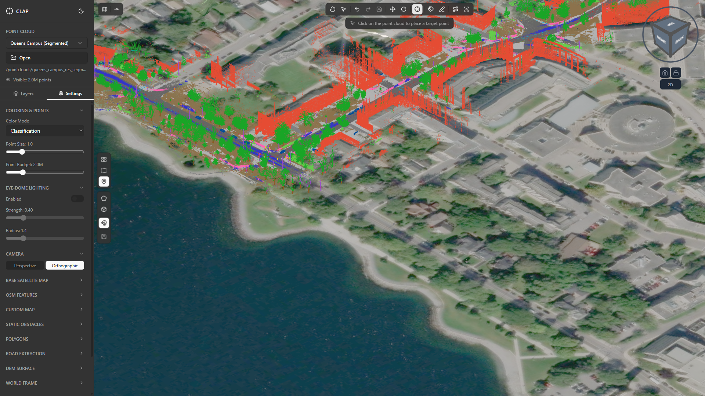
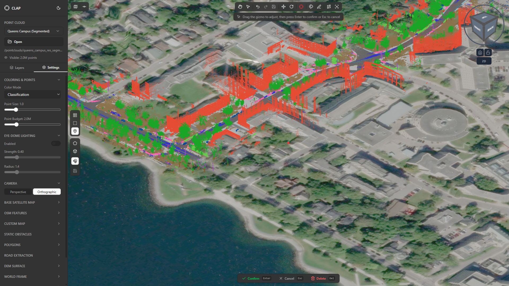
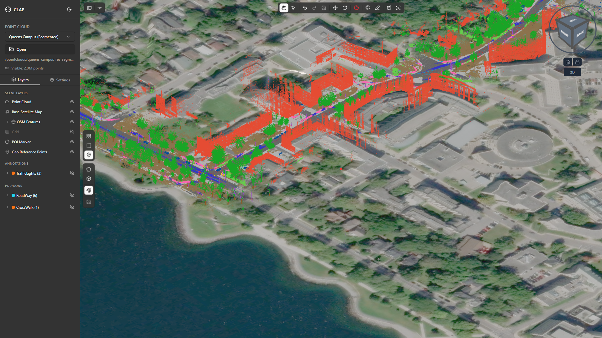

# 05 — Points of Interest (POIs)

## Overview

A **Point of Interest (POI)** is a named 3D marker you can pin anywhere inside the point cloud scene. It appears as a visible sphere in the viewport and is listed in the **Layers** panel so you can toggle its visibility at any time.

POIs are useful for:

- **Navigation anchors** — drop a marker on a landmark (e.g., a building entrance, a lamp post) so you can quickly orbit back to that exact spot after panning away.
- **Reference points** — give other team members a shared spatial reference when reviewing a scene or discussing annotations.
- **Measurement references** — use the POI as one endpoint of an informal distance check by positioning it on a known feature and reading the coordinates from the Layers panel.

Only **one POI exists at a time**. Placing a new one automatically replaces the previous marker.

---

## 1. Activating Set Target POI Mode

The **Set Target POI** button sits in the top-center toolbar, to the right of the Rotate button and to the left of the Annotate button. Its icon is a target/crosshair.

**Steps:**

1. Make sure a point cloud is loaded (e.g., *Queens Campus (Segmented)*).
2. Click **Set Target POI** in the toolbar. The button highlights to show the mode is active.
3. Your cursor changes to a crosshair when hovering over the viewport, indicating click-to-place mode.

> **Tip:** You can also enter POI mode with the keyboard shortcut shown in the toolbar tooltip. Press **Escape** at any time to cancel without placing a marker.

---

## 2. Placing the POI Marker

With Set Target POI mode active, click anywhere inside the 3D viewport. CLAP projects the click ray into the scene and places the marker on the first point cloud surface it intersects.

What happens immediately after clicking:

- A **sphere marker** appears at the clicked location in the 3D scene.
- A **3D transform gizmo** (colored axis handles) overlays the marker so you can fine-tune its position right away.
- The toolbar updates: **Set Target POI** is replaced by **Move POI** and **Delete POI** options.
- The **Layers** panel (sidebar) gains a new entry: **POI Marker**.

> **Note:** If you click on empty space (no point cloud surface under the cursor), CLAP places the marker at a default depth along the camera ray. Clicking directly on dense geometry gives the most accurate placement.

---

## 3. Fine-Tuning Position with the Gizmo

Immediately after placement — or after clicking **Move POI** — a 3D gizmo appears on the marker. The gizmo provides three colored axis arrows (X = red, Y = green, Z = blue) and three colored plane handles.

**Using the gizmo:**

| Handle | Behavior |
|--------|----------|
| Axis arrow (red/green/blue) | Drag to constrain movement to that single axis |
| Plane handle (corner squares) | Drag to move freely within the XY, XZ, or YZ plane |
| Center sphere | Drag to move freely in all three axes relative to the camera view |

**Tips for precise placement:**

- Orbit the camera to a side view before dragging a vertical (Z) axis handle — this makes it easier to see height changes.
- Zoom in close before using plane handles for sub-meter accuracy.
- Use the coordinate display in the status bar or Layers panel to confirm the final position numerically.

---

## 4. The POI in the Layers Panel

After placement, open the **Layers** tab in the left sidebar. A new row labelled **POI Marker** appears below any point cloud layer entries.

From the Layers panel you can:

- **Toggle visibility** — click the eye icon to hide or show the marker sphere in the viewport without deleting it. This is useful when the marker overlaps geometry you need to inspect.
- **View coordinates** — some builds display the X/Y/Z world position next to the layer name.
- **Access the context menu** — click the three-dot (…) menu on the POI Marker row to reveal **Delete POI** and other actions without touching the toolbar.

---

## 5. Moving the POI

If you need to relocate the marker after the initial gizmo has been dismissed, use the **Move POI** option that appears in the toolbar whenever a POI exists in the scene.

**Steps:**

1. Click **Move POI** in the toolbar. The 3D gizmo reappears on the existing marker.
2. Drag the desired axis arrow or plane handle to reposition.
3. Click anywhere outside the gizmo (or press **Escape**) to confirm and dismiss the gizmo.

> The POI world coordinates update in real time while you drag, so you can use this to align it precisely to a grid or known elevation.

---

## 6. Deleting the POI

To remove the POI entirely:

- Click **Delete POI** in the toolbar, **or**
- Open the Layers panel, click the three-dot menu on the **POI Marker** row, and choose **Delete**.

The marker is removed from the scene and from the Layers panel. The toolbar reverts to showing **Set Target POI** so you can place a fresh marker whenever needed.

---

## 7. Practical Tips

### Centering the View on a POI

After placing a POI on a landmark, you can quickly return to it:

1. In the Layers panel, click the **POI Marker** row to select it (or use the layer context menu → **Focus**).
2. The viewport camera smoothly orbits to frame the marker at the center of the screen.

This is especially useful in large scenes (e.g., the full Queens Campus cloud) where manually panning back to a specific feature can take time.

### Using a POI as a Measurement Reference

1. Place the POI on the first feature you want to measure from (e.g., one corner of a building).
2. Note the X/Y/Z coordinates shown in the Layers panel.
3. Switch to the **Point Info** tool (rightmost toolbar button) and hover over the second feature to read its coordinates.
4. Calculate the Euclidean distance manually, or paste both coordinate pairs into a spreadsheet.

### Working with the POI Alongside Reclassification

A common workflow is to drop a POI on a problematic cluster of points (e.g., misclassified vegetation near a roofline), perform a reclassification pass with the **Reclassify Points** or **2D Polygon** tool, then delete the POI when done. The marker keeps your place so you do not lose track of the target area while switching tools.

---

## Summary

| Action | How |
|--------|-----|
| Place POI | Toolbar → Set Target POI → click viewport |
| Fine-tune position | Drag gizmo handles immediately after placement |
| Move existing POI | Toolbar → Move POI → drag gizmo |
| Toggle visibility | Layers panel → eye icon on POI Marker row |
| Delete POI | Toolbar → Delete POI, or Layers panel → three-dot menu → Delete |
| Return to POI in view | Layers panel → click POI Marker row → Focus |
