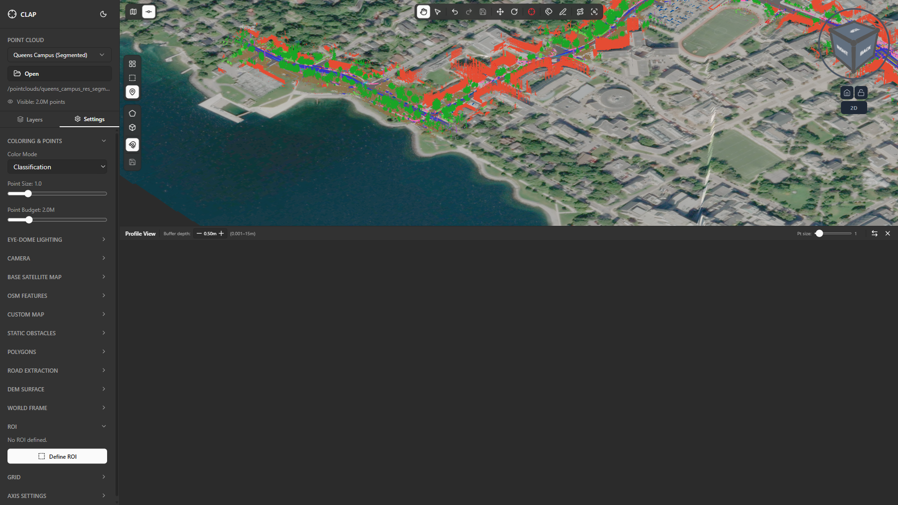
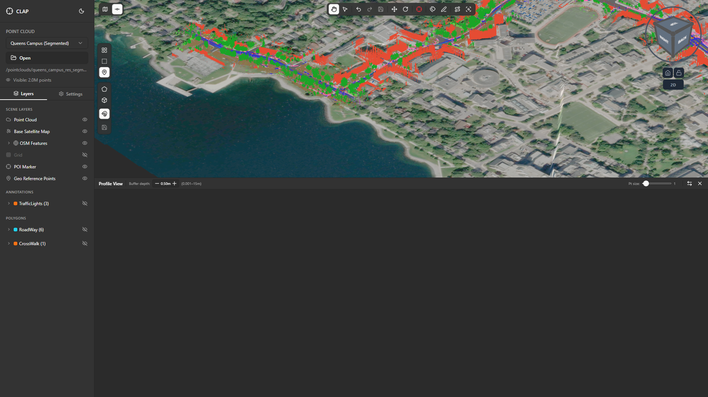

# 06 — Regions of Interest (ROIs)

## Overview

A **Region of Interest (ROI)** is a bounded volume or area you draw directly in the 3D viewport to isolate a spatial subset of the point cloud. Once defined, the ROI can **crop** the scene so that only points inside the boundary are visible, letting you focus annotation and reclassification work on a specific structure without the surrounding cloud creating visual clutter.

Typical use cases:

- **Building isolation** — draw a 3D box around a single building to reclassify its roof points without accidentally selecting neighbouring trees.
- **Road segment focus** — define a 2D rectangle along a street corridor and crop to it before running a lane-marking reclassification pass.
- **Vertical slice inspection** — use a thin box or cylinder to inspect a cross-section of the point cloud (e.g., a utility pole or a wall face).
- **Quality review** — outline a suspect area and share the ROI definition with a colleague so they inspect exactly the same region.

Multiple ROIs can be stacked in the same scene. Each is listed independently and can be cropped, hidden, or removed without affecting the others.

---

## 1. The ROI Button

The ROI button is located in the **top-right area of the viewport** (not part of the main top-center toolbar). It is distinct from the annotation toolbar buttons and is always visible regardless of the active tool.

Click the **ROI** button to open the shape-type picker overlay.

---

## 2. Selecting a Shape Type

After clicking the ROI button, a small panel appears offering four shape types:

| Shape | Best for |
|-------|----------|
| **3D Box** | Enclosing a volumetric feature (building, vehicle, pole cluster) |
| **Cylinder** | Circular features (roundabouts, trees, tanks) |
| **2D Rectangle** | Flat horizontal or vertical slices through the cloud |
| **2D Polygon** | Irregular footprints (curved road segments, oddly-shaped lots) |

Click the desired shape to enter drawing mode. The cursor changes to indicate you are in draw mode.

> **Tip:** You can press **Escape** at any time during drawing to cancel without creating an ROI.

---

## 3. Drawing a 3D Box ROI

The **3D Box** is the most commonly used ROI type and the most flexible for volumetric annotation work.

**Step-by-step:**

1. Select **3D Box** from the shape picker.
2. **Click once** in the viewport to place the first corner of the box base.
3. **Move the cursor** — a rectangle preview expands to show the box footprint.
4. **Click again** to set the opposite corner of the box base. The box height is computed automatically from the point cloud extents, or you may be prompted to drag vertically for the height.
5. Release to confirm. The box appears as a wireframe outline in the viewport.
6. A **3D gizmo** immediately overlays the box for fine-tuning.

> **Note:** CLAP snaps the box base to the dominant horizontal plane of the local point cloud when possible, so the box sits flush with the ground surface rather than floating.

---

## 4. Drawing a 2D Rectangle ROI

A **2D Rectangle** is drawn with a single click-drag gesture and produces a flat rectangular region. It is useful for selecting a horizontal slab or a vertical cross-section.

**Step-by-step:**

1. Select **2D Rectangle** from the shape picker.
2. **Click and hold** at one corner of the desired region.
3. **Drag** across the viewport — a preview rectangle stretches as you move.
4. **Release** the mouse button to confirm the rectangle.
5. The rectangle appears as a flat wireframe outline and the gizmo appears for adjustment.

> **Tip:** Orbit the camera to a top-down (plan) view before drawing a 2D Rectangle so the footprint aligns with the ground plane naturally.

---

## 5. Drawing a 2D Polygon ROI

A **2D Polygon** lets you trace an irregular boundary by clicking individual vertices.

**Step-by-step:**

1. Select **2D Polygon** from the shape picker.
2. **Click** to place the first vertex.
3. Continue **clicking** to add successive vertices. Each click adds a new corner; a line connects the last two points.
4. **Close the polygon** by clicking on the first vertex (it highlights when your cursor is close enough to snap). The polygon fills and becomes a closed shape.
5. The gizmo appears for adjustment.

> **Tip:** For road segments, trace the polygon along the lane edges from a near-plan-view camera angle, then use the gizmo to adjust the depth extent after closing.

---

## 6. Drawing a Cylinder ROI

A **Cylinder** is ideal for circular or radially symmetric features.

**Step-by-step:**

1. Select **Cylinder** from the shape picker.
2. **Click** in the viewport to place the cylinder center point.
3. **Drag outward** — a circle preview shows the radius expanding.
4. **Release** to confirm the radius. The cylinder height is set automatically or prompted as a second drag.
5. The gizmo appears for adjustment.

---

## 7. The ROI Gizmo — Adjusting After Drawing

After any ROI is drawn, a **transform gizmo** appears on the shape. This works identically to the POI gizmo and lets you adjust the ROI without redrawing it.

**Gizmo controls:**

| Handle | Effect |
|--------|--------|
| Axis arrows (red/green/blue) | Translate along a single axis |
| Plane handles (corner squares) | Translate within a 2D plane |
| Arc/rotation handles (if visible) | Rotate the ROI around an axis |
| Edge/corner scale handles (3D Box) | Resize the box by dragging a face or corner |

**Workflow tip:** After placing a 3D Box around a building, orbit to a side view and drag the top-face handle upward to ensure the box fully covers the roofline. Then switch to a top view and shrink the sides so the box does not bleed into adjacent structures.

---

## 8. Enabling the Crop (Clipping Points Outside the ROI)

Once an ROI is drawn, the real power comes from **cropping**: hiding all points that fall outside the ROI boundary so you see only the enclosed region.

**To enable cropping:**

1. With an ROI present, look for the **Enable Crop** button in the ROI action bar (appears below or adjacent to the ROI outline, or in the ROI panel/toolbar).
2. Click **Enable Crop**. All points outside the ROI disappear from the viewport.
3. Work on annotations or reclassification normally — only the isolated region is shown.
4. Click **Disable Crop** (the same button, now toggled) to restore the full point cloud view.

> **Important:** Cropping is non-destructive. Hidden points are not deleted; they are simply excluded from the current view. Saving the project while cropped does not remove those points.

---

## 9. Toggling ROI Outline Visibility

The wireframe outline of the ROI can be shown or hidden independently of the crop state.

**To toggle the outline:**

- Use the **Show Outlines / Hide Outlines** button in the ROI action bar, **or**
- Find the ROI entry in the Layers panel and click its eye icon.

Hiding the outline is useful when you want to inspect the cropped region without the wireframe box obscuring the points near the boundary.

---

## 10. Redefining an Existing ROI

If the drawn shape does not enclose the intended area precisely enough, you can **redefine** it without clearing it first.

**Steps:**

1. Click **Redefine ROI** in the ROI action bar.
2. The existing shape is temporarily cleared and drawing mode re-enters, with the same shape type pre-selected.
3. Draw the new shape. The new definition replaces the old one.
4. The gizmo appears for immediate fine-tuning.

> **Tip:** If you want to try a different shape type, use **Clear ROI** to remove the current one, then click the ROI button again to choose a new shape type.

---

## 11. Clearing and Removing ROIs

To remove an ROI entirely:

- Click **Clear ROI** in the ROI action bar, **or**
- Open the Layers panel, locate the ROI entry, open the three-dot context menu, and choose **Delete**.

When a crop is active, clearing the ROI also restores full point cloud visibility automatically.

If multiple ROIs are stacked, each has its own **Clear** action. Clearing one ROI does not affect others.

---

## 12. Practical Tips

### Isolating a Building for Reclassification

1. Orbit to a top-down view of the Queens Campus scene.
2. Click the **ROI** button and select **3D Box**.
3. Click and place two corners around the target building footprint.
4. Switch to a side view and adjust the gizmo to ensure the box covers the full building height including the roofline.
5. Click **Enable Crop** — only the building's points are now shown.
6. Switch to the **Reclassify Points** or **Annotate** tool and correct any misclassified points (e.g., roof points labelled as vegetation).
7. When finished, click **Disable Crop** and then **Clear ROI** to return to the full scene.

### Isolating a Road Segment

1. Switch to a near-top-down view aligned with the road direction.
2. Click **ROI → 2D Polygon**.
3. Trace the polygon along the road edges (include the kerb-to-kerb width), closing the polygon at the far end of the segment.
4. Enable Crop and use **Reclassify Points** to separate road surface, kerb, and pavement classifications.
5. Advance the ROI along the road by clicking **Redefine ROI** and drawing the next segment, working your way along the corridor systematically.

### Stacking Multiple ROIs

You can draw additional ROIs while one already exists. Each ROI is listed as a separate entry in the Layers panel. Enabling Crop on a second ROI keeps points inside *either* ROI visible. Use this to compare two features side by side (e.g., two buildings in the same scene) without switching back and forth.

---

## Summary

| Action | How |
|--------|-----|
| Open ROI mode | Top-right viewport ROI button |
| Choose shape | Click 3D Box / Cylinder / 2D Rectangle / 2D Polygon |
| Draw 3D Box | Click first corner, move, click second corner |
| Draw 2D Rectangle | Click-drag diagonally |
| Draw 2D Polygon | Click vertices, click first vertex to close |
| Draw Cylinder | Click center, drag radius outward |
| Fine-tune shape | Drag gizmo handles (translate / scale / rotate) |
| Crop to ROI | ROI action bar → Enable Crop |
| Toggle outline | ROI action bar → Show/Hide Outlines (or Layers eye icon) |
| Redefine ROI | ROI action bar → Redefine ROI |
| Remove ROI | ROI action bar → Clear ROI, or Layers panel → Delete |
